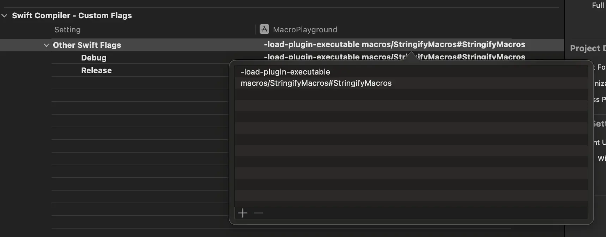

# swift-macros

## How to import on a project as a binary

### Compiling the macro into a binary

Even though the `.macro` target (`swift-macros`) is not declared as an executable product, a binary will still be generated for it by SPM so that it can be implicitly used by consumers of the macro when importing the package.

To do so, navigate into the package directory and call the swift build command with the release configuration:

```dash
swift build -c release
```

This is the binary you are interested in as it contains the macro definitions and implementations and is the only piece of the package that you need for this use case to work. You will need to do what SPM is most likely doing under the hood to explicitly import the macro implementation into your Xcode project.

To find the binary, navigate to the `.build > release` directory and you should see a file named after the .macro target in your package manifest (e.g. `swift-macros`).

### Importing the macro binary into your target

Now that you have the binary ready, you can import it into your project by making a couple of changes to the target where you want to use your new macro.

First, drag and drop the binary you created in the last section into the directory where your project lives. I would recommend moving it into the root directory of the project (next to the `.xcodeproj` file) and creating a new directory called `Macros` to keep things tidy.

Next, go to the target's Build Settings in Xcode and look for the Other Swift Flags settings under the `Swift Compiler - Custom Flags` section. You will need to add a flag called `-load-plugin-executable` and set it to a string composed by the path to the binary you just created and the name of the `.macro` target in your package manifest joined by a hash symbol (e.g. `macros/swift-macros#swift_macrosMacros`):



Finally, as you're no longer using the Swift package's library product with the macro definition, you will need to declare it in your target's source files to start using it.

To do so, create a new Swift file and copy the macro definition from the Swift package over:

```swift
@freestanding(expression)
public macro stringify<T>(_ value: T) -> (T, String) = #externalMacro(module: "swift_macrosMacros", type: "StringifyMacro")
```

Copied from [swift_macros.swift](Sources/swift-macros/swift_macros.swift)

### [Optional] Does the macro even need to be a macro target? Or a Swift Package? 🤪

Considering you don't need the macro definition library for this to work, I tried to replace it with a single executable product associated with the macro target to see if I could still get the same binary output but, as soon as I did, Xcode started crashing! 🤪

This made me think that the macro target is probably doing something special under the hood to make a special binary for consumers to use but then I remembered that Pedro mentioned in his article that to get macros to work in a Tuist project you just need to create a macOS executable target with the right code in it, so I decided to give it a go in my Swift Package.

I removed all targets and products from the package manifest and replaced them with a single executable target called StringifyMacros containing the same code as the original .macro target:

```swift
// swift-tools-version: 5.9

import PackageDescription

let package = Package(
    name: "Stringify",
    platforms: [.macOS(.v10_15), .iOS(.v13), .tvOS(.v13), .watchOS(.v6), .macCatalyst(.v13)],
    products: [
        .executable(name: "StringifyMacros", targets: ["StringifyMacros"])
    ],
    dependencies: [
        .package(url: "https://github.com/apple/swift-syntax.git", from: "509.0.0"),
    ],
    targets: [
        .executableTarget(
            name: "StringifyMacros",
            dependencies: [
                .product(name: "SwiftSyntaxMacros", package: "swift-syntax"),
                .product(name: "SwiftCompilerPlugin", package: "swift-syntax")
            ]
        ),
    ]
)
```

I compiled the package again and imported the resulting binary into my Xcode project and, to my surprise, it worked!

This means that you don't need to have a macro target or even a Swift package to create and use a Swift macro in your project, which opens the door to a lot of interesting use cases and possibilities.

REFERENCE: [How to import Swift macros without using Swift Package Manager](https://www.polpiella.dev/binary-swift-macros)
